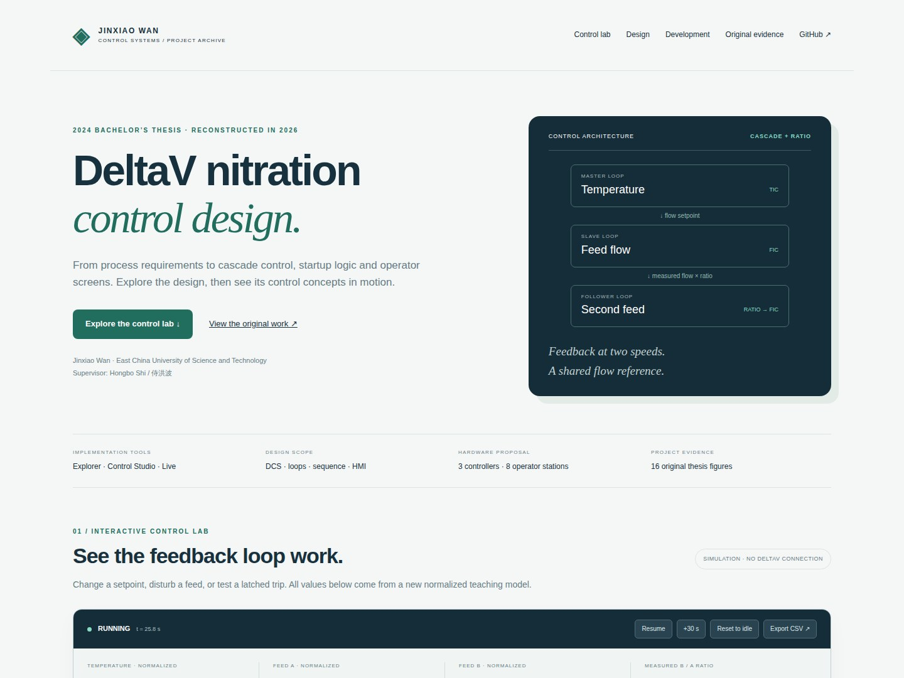
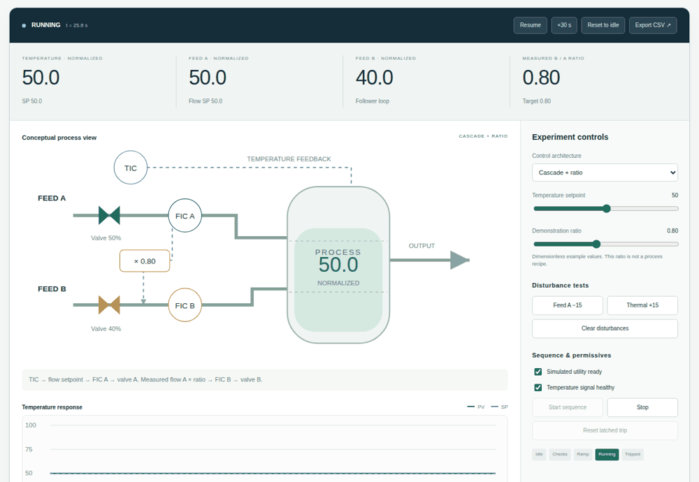
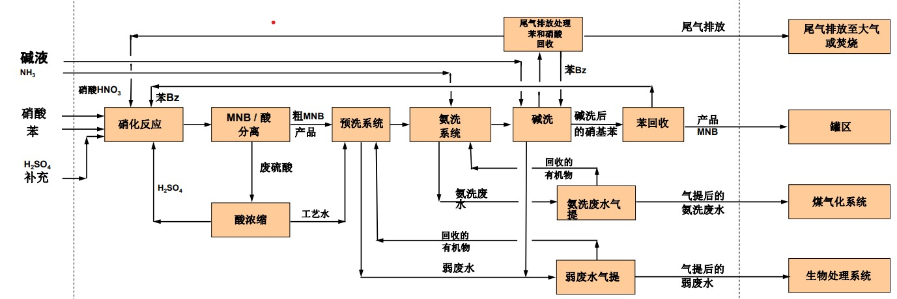
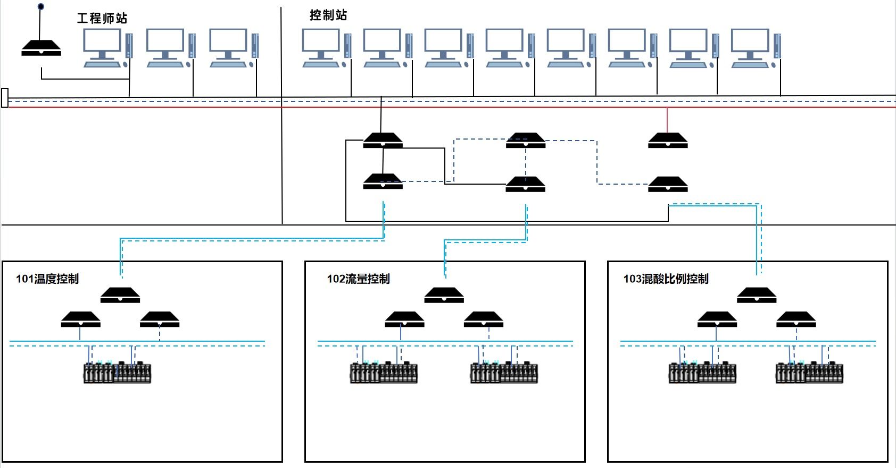
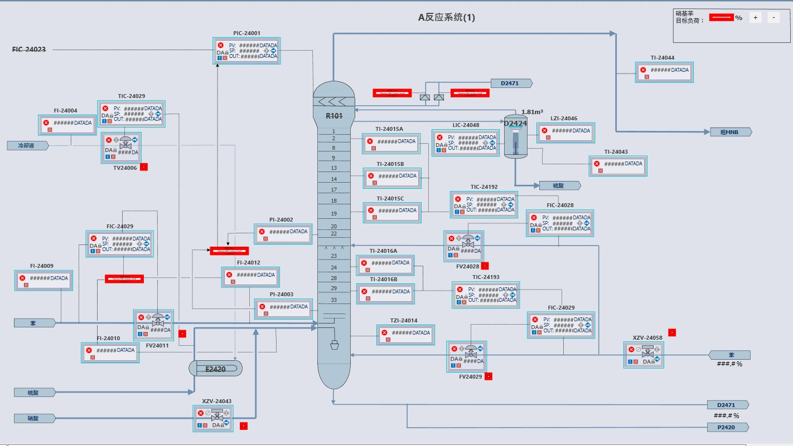
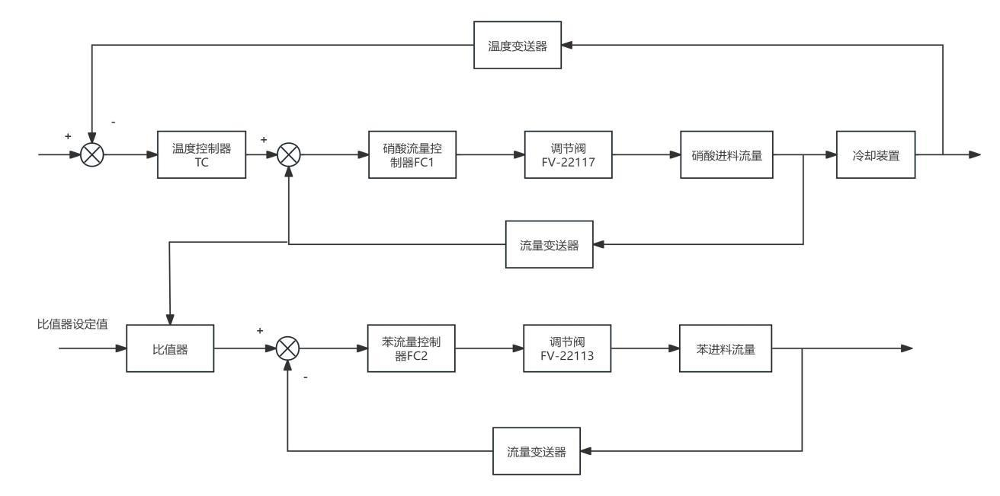
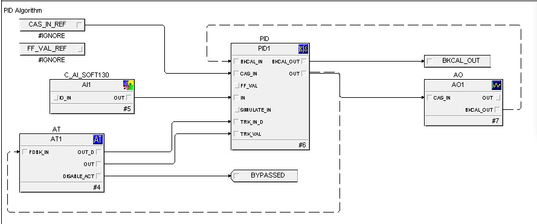
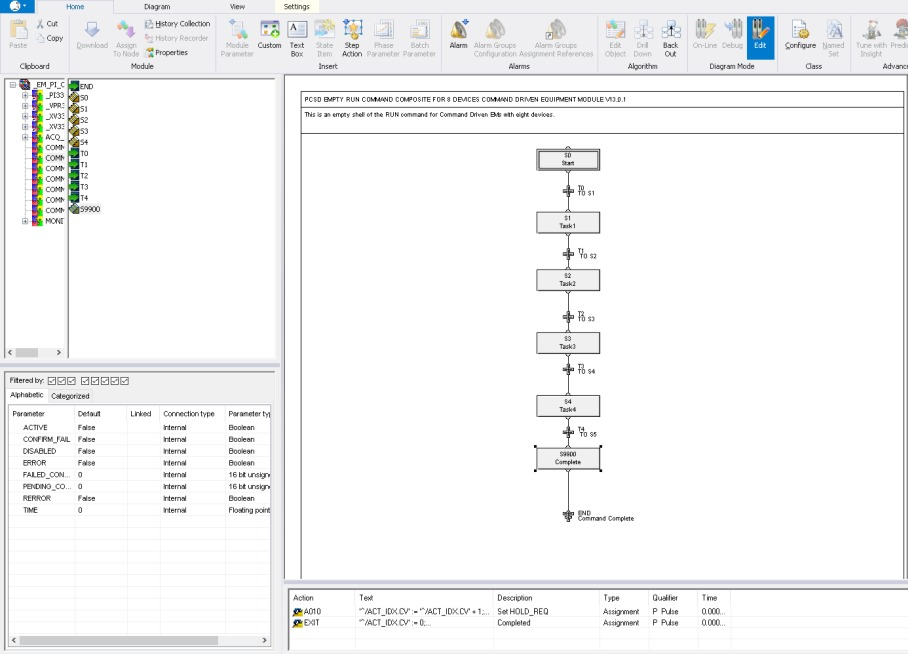
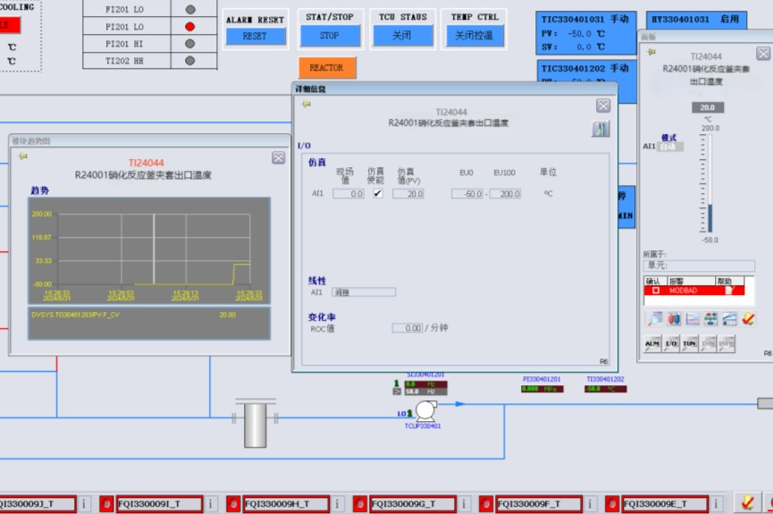
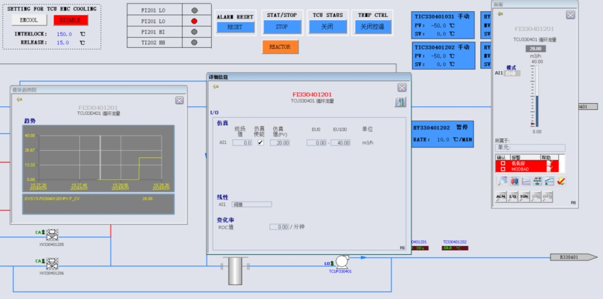

# DeltaV Nitration Process Control

**Jinxiao Wan · Automation bachelor thesis · 2024**  
基于 DeltaV 系统的硝化反应装置控制系统设计

An illustrated reconstruction of a DeltaV control-system design, combining the original thesis diagrams, configuration screenshots and simulation trends with a new interactive browser demonstrator.

[Open the browser demo](https://jinxiao-wan.github.io/DeltaV-Nitration-Process-Control-/) · [Design](docs/control-design.md) · [Hardware and I/O](docs/hardware-and-io.md) · [Development process](docs/development-process.md) · [Source audit](docs/source-audit.md)

> The demo link becomes available after GitHub Pages is enabled with **GitHub Actions** as its source. See [deployment instructions](docs/deployment.md).

## Browser preview





The 2026 browser demonstrator: running → signal-loss trip → restored signal and reset to idle. A separate start is required after reset.

## Original project



The thesis investigates control design for a nitration unit using DeltaV: system architecture, field I/O, temperature–flow cascade control, feed ratio control, startup sequencing, alarms, operator displays and simulated trends. The defence presentation describes the work as theoretical/simulation-level research requiring production validation.

| System architecture | Original operator display |
|---|---|
|  |  |

## Try the reconstruction

The browser demonstrator runs without DeltaV or additional software. Visitors can:

- Change temperature setpoint and feed ratio, and watch temperature and flow trends.
- Compare single-loop and cascade control against the same disturbance.
- Apply flow and thermal disturbances and inspect controller response.
- Test startup permissives, signal loss, a latched trip, reset and separate restart.
- Export simulated trend data as CSV and enlarge all 16 archived figures.

The 2026 demonstrator uses a **new normalized teaching model**. Its dynamics, controller tuning, startup timings and trip thresholds are illustrative. Its results are not measured plant data or thesis performance benchmarks. See [model specification](docs/simulation-model.md).

## Control design



The outer temperature controller provides the inner feed-flow controller setpoint. A second feed follows a ratio of the measured first-feed flow. The thesis also discusses cascade tracking and module links.

| Control configuration | Startup configuration |
|---|---|
|  |  |

| Original temperature trend | Original flow trend |
|---|---|
|  |  |

## Hardware and engineering evidence

The source architecture contains three controller areas, one engineering station and eight operator stations, with fieldbus and conventional I/O. Original architecture, fieldbus, I/O and configuration figures are included. No native electrical CAD, PCB, enclosure CAD or DeltaV FHX export was found in the supplied archive; the repository therefore documents the recovered system design without claiming those files exist.

The thesis contains conflicting I/O inventories:

| Source | AI | AO | DI | DO | Total |
|---|---:|---:|---:|---:|---:|
| Body text, printed page 12 | 49 | 4 | 5 | 10 | 68 |
| Table 3.1, printed page 13 | 42 | 30 | 3 | 3 | 78 |

Both records are preserved rather than presented as a reconciled final inventory.

## Whole development process

1. Define the process and control requirements.
2. Plan the DeltaV architecture and field I/O.
3. Design temperature, flow, ratio, startup and alarm logic.
4. Configure modules and operator displays; examine simulated trends.
5. Reconstruct the evidence and a browser demonstrator for public review in 2026.

[Read the illustrated development record](docs/development-process.md).

## Repository contents

| Path | Purpose |
|---|---|
| `web/` | Responsive browser demonstrator and original figure gallery |
| `docs/` | Control design, architecture, provenance and model documentation |
| `design/` | Machine-readable conceptual control map and both source I/O inventories |
| `tests/` | Model and desktop/mobile browser checks |
| `scripts/` | Local server and reproducible simulation CSV export |
| `.github/workflows/` | Automated checks and GitHub Pages deployment |

## Run locally

Node.js 22 or newer. No runtime dependencies.

```sh
npm start
# Open http://localhost:4173
npm test
npm run demo:csv
```

CSV exports are written to `outputs/`. Browser verification uses Playwright installed by the checks workflow.

## Source and attribution

Reconstructed from the supplied final thesis and defence presentation. Figures are extracted from the thesis and retain their source context; some original diagrams draw on cited literature/vendor material. [Figure-by-figure provenance](docs/visual-sources.json) records page numbers and hashes. Cover/signature pages and the full source archive are not published. No blanket open-source licence is asserted over original or third-party figures. DeltaV is an Emerson product; this project is an independent academic portfolio reconstruction.
