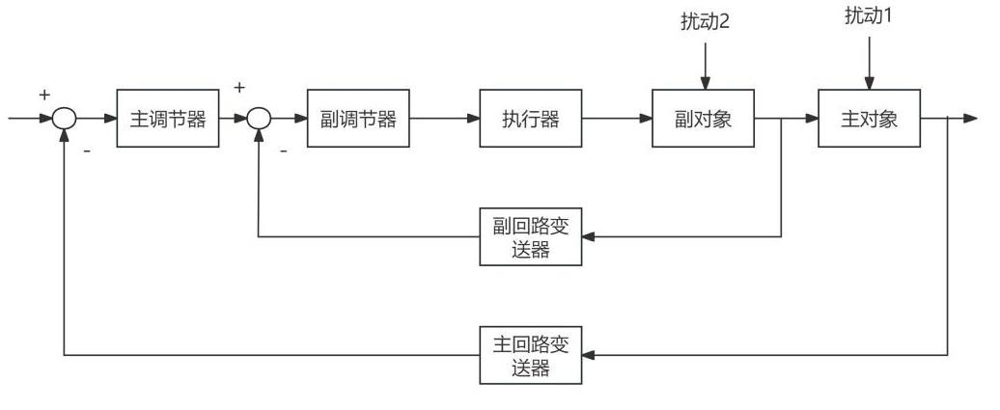
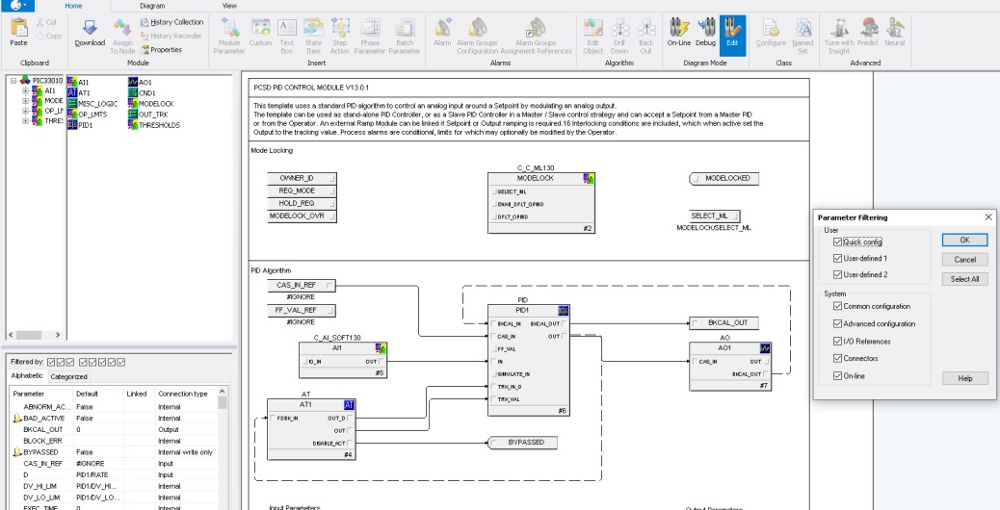
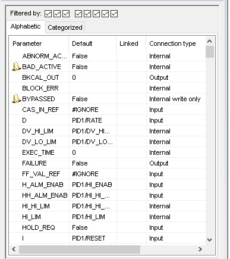

# Control design

The original design combines temperature–flow cascade control and a feed-ratio follower. Figures 4-2 through 4-4 compare the structures (printed pages 16–17).

The temperature master supplies the inner flow controller setpoint. The second flow target follows the measured first feed through a ratio block. Source prose references FIC-22117 and FFIC-22113; a complete verified tag inventory cannot be recovered from the archive.

The thesis discusses CAS_IN and back-calculation/tracking connections. These images provide design evidence, not an importable configuration. Native FHX or control-database exports were absent.

Printed page 23 lists initial PID values Kp=1.305, Ki=0.018 and Kd=3.241. The available text does not establish their exact time units and implementation convention. Literature-derived transfer functions are also discussed. The browser model uses separately documented normalized dynamics and tuning, rather than treating those values as validated process parameters.

The source describes both cooling and feed-flow temperature actuation, leaving physical sign and scaling ambiguous. The reconstruction chooses a positive feed-to-temperature response and negative feedback explicitly for teaching.

