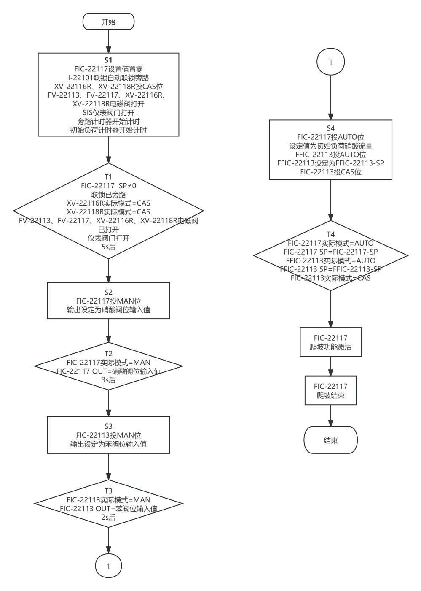
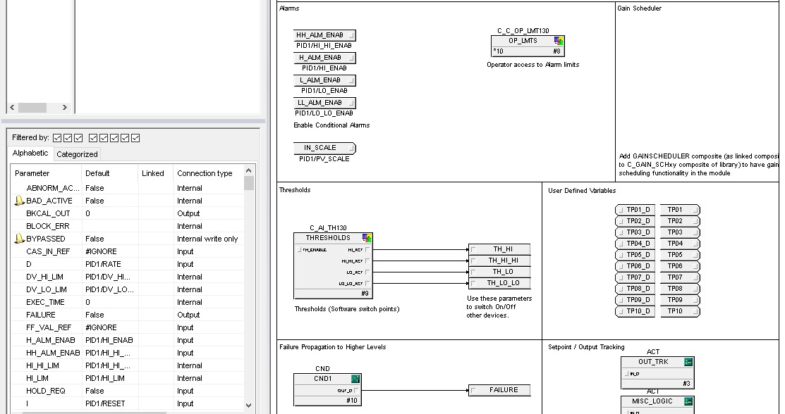

# Development process

## 2024 academic project

The final thesis is dated June 9, 2024; the defence slides are dated June 4, 2024. These stages reconstruct the thesis chapter progression, rather than a recovered dated engineering change log.

1. **Requirements and process context.** Review nitration process literature, identify measurements, actuators and temperature/flow objectives.

2. **Architecture and I/O.** Plan controllers, engineering/operator stations and field connections. See the unresolved I/O counts in the hardware document.

3. **Control and sequence design.** Develop single-loop, cascade and composite structures, plus startup sequencing and alarm settings.

4. **DeltaV configuration and visual review.** Configure modules, sequence blocks and operator displays, then examine simulation trends.

Defence slide 22 describes simulated values producing trends in DeltaV Operate. Slide 25 qualifies the research as theoretical/simulation-level and needing production validation. The archive does not establish plant commissioning or measured operating performance.

## 2026 portfolio reconstruction

Extract and attribute 16 original figures; audit contradictions and missing native files; build a normalized browser model; add reproducible disturbance comparisons, state transitions and CSV export; verify model behavior and responsive browser interactions; publish the static site through GitHub Pages.
