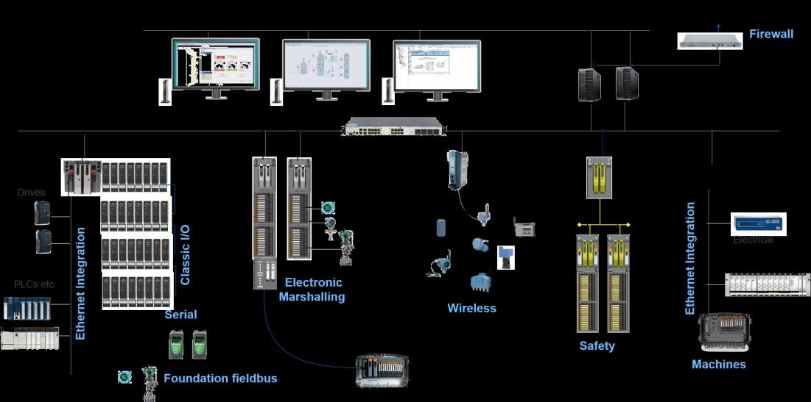
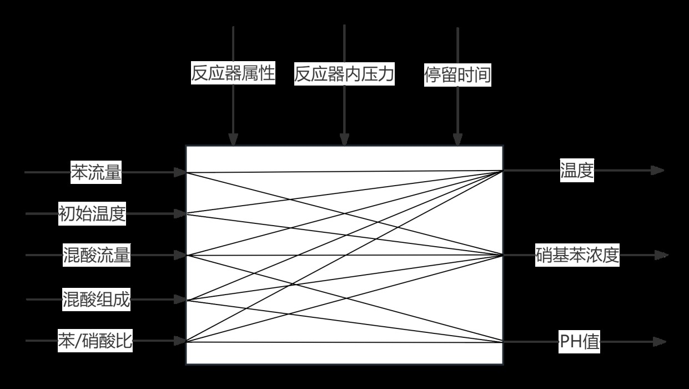

# System architecture and I/O

The recovered design specifies three controller areas, one engineering station and eight operator stations. Fieldbus and conventional I/O connect field measurements and actuators to the DeltaV system.

| Source | AI | AO | DI | DO | Sum |
|---|---:|---:|---:|---:|---:|
| Printed page 12 body text | 49 | 4 | 5 | 10 | 68 |
| Printed page 13 table 3.1 | 42 | 30 | 3 | 3 | 78 |

Table 3.1 refers to area 301. These contradictory counts are archived in `design/io-inventory.json`; neither is asserted as a final as-built inventory. Exact controller part numbers, wiring terminals, procurement list, electrical CAD and native hardware configuration were not recovered. This is a control-system architecture portfolio, not a fabricated PCB or SolidWorks package.
